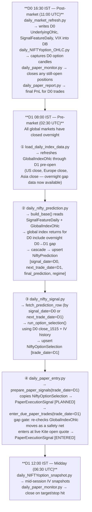

# Stockie26

NIFTY options trading signal system — cascade prediction, option selection, and paper execution.

## Daily Signal Flow

The pipeline runs across three cron windows each trading day (`daily_cron_dispatcher.py`):

## Date Semantics

| Column | Table | Meaning |
|---|---|---|
| `signal_date` | `NiftyPrediction` | D0 — NIFTY close being observed by the model |
| `next_trade_date` | `NiftyPrediction` | D1 — next NSE trading day (execution day) |
| `trade_date` | `NiftyOptionSelection` | D1 — day the option will be bought |
| `paper_trade_date` | `PaperExecutionSignal` | D1 — day the trade was physically entered |
| `signal_trade_date` | `PaperExecutionSignal` | D0 — original signal day (used for holiday gap gate) |
| `trade_date` | `GlobalIndexOhlc`, `UnderlyingOhlc`, `OptionOhlc` | Candle date for that market (unrelated to prediction date naming) |

**Gap gate note:** The global overnight gap (US/Europe/Asia D0→D1 moves) is loaded in step ① *before* prediction runs. By the time the cascade runs in step ②, `global_us_return_mean` etc. already incorporate the overnight move and influence the prediction itself. The gap gate check inside `daily_paper_entry.py` (step ④) is a secondary safety net for stale data or multi-day holiday gaps.

## Project Structure

| Folder | Purpose |
|---|---|
| `src/technical_analysis/cascade/` | Feature dataset assembly, cascade prediction engine |
| `src/technical_analysis/optionselection/` | Option strategy selection |
| `src/execution/` | Paper trade entry, monitoring, gap gate |
| `src/data_manager/db/` | Supabase/Postgres client, upsert helpers, migrations |
| `scripts/daily_NIFTY/` | Daily operational scripts (cron entry points) |
| `scripts/Common/` | Backfill and utility scripts |
| `backtest/` | Production PnL replay, vectorbt research |
| `output/backtest/NIFTY/production/` | Prediction CSV and summary outputs |
| `TeamDocs/` | Schema references and module documentation |
